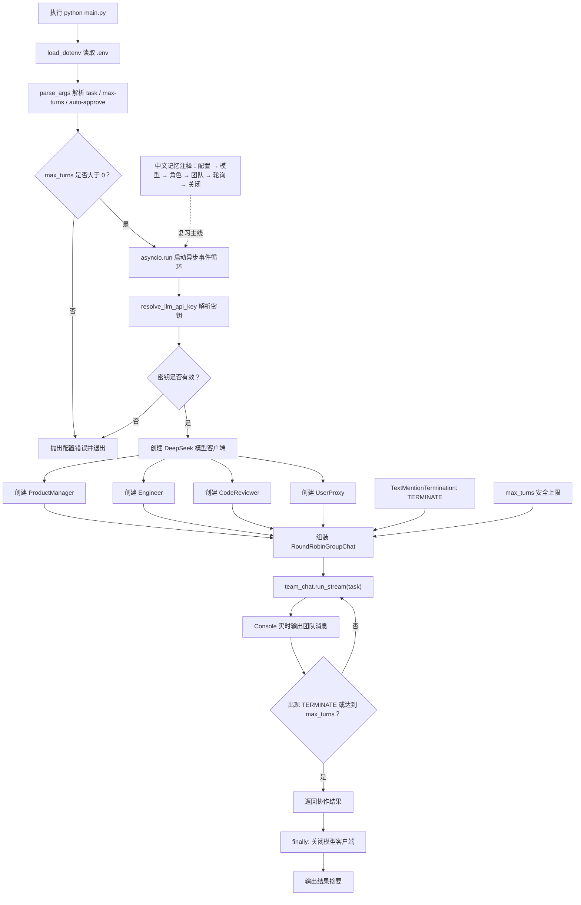
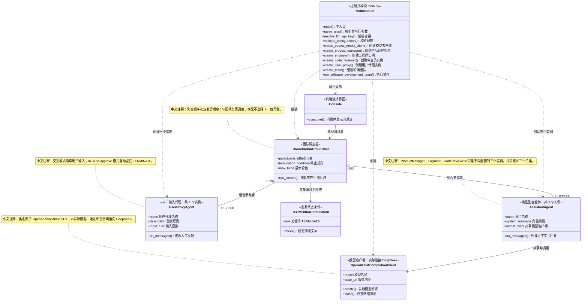
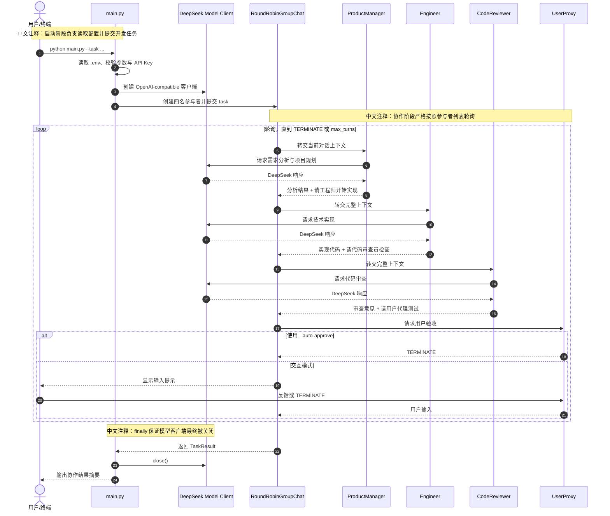
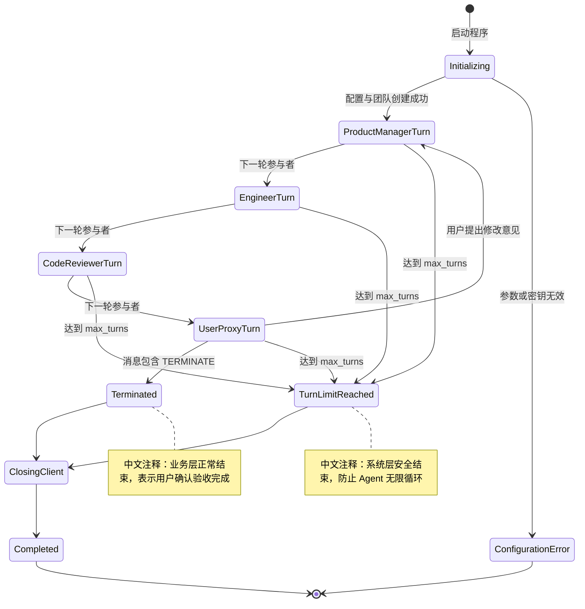
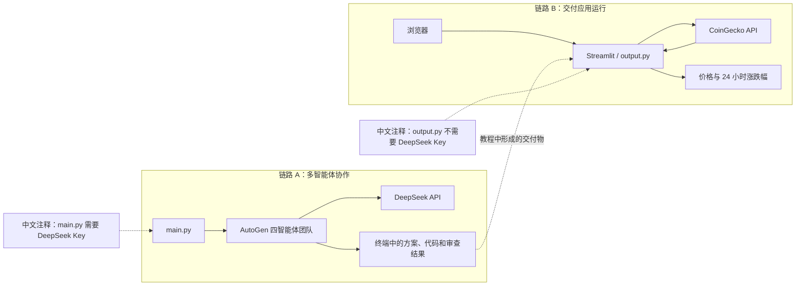
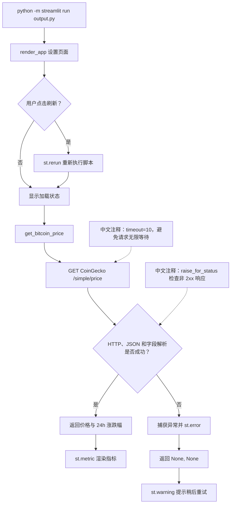
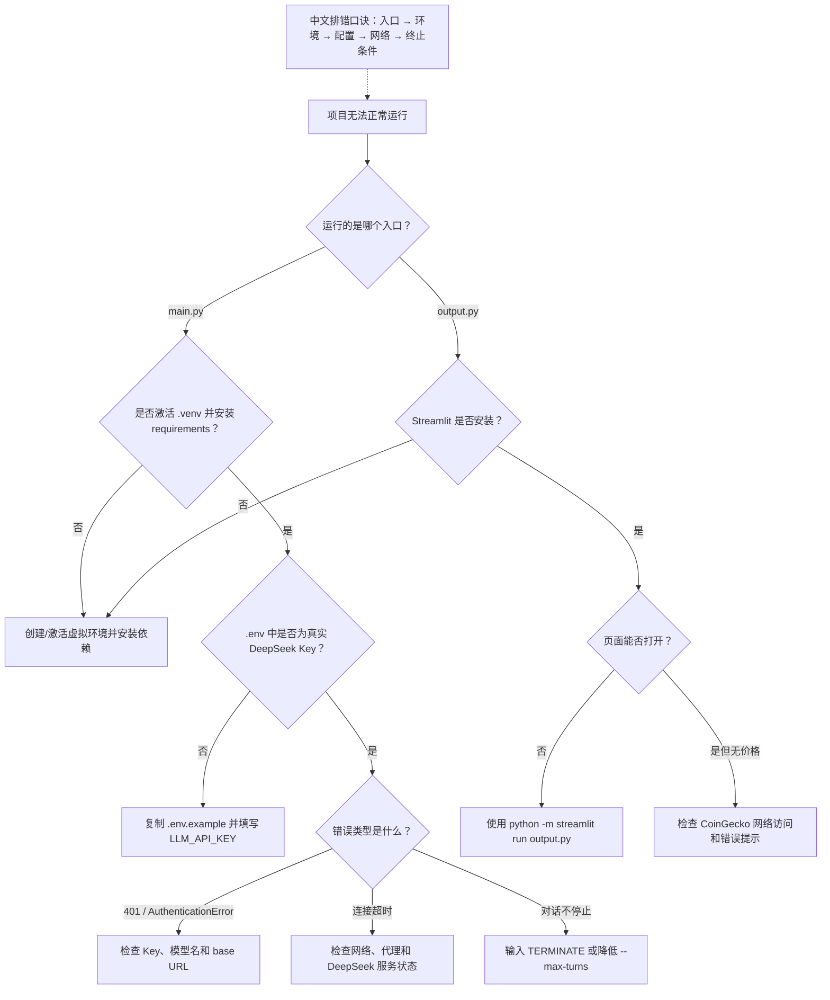

# AutoGen 软件开发团队：学习图谱

这份图谱对应 `main.py`、`autogen_software_team.py` 和 `output.py`。建议按下面顺序学习：

1. 总流程图：先建立全局执行路径
2. UML 类图：记住对象及依赖关系
3. 时序图：理解一次协作怎样发生
4. 状态图：掌握轮询和终止机制
5. 成品应用数据流图：区分团队协作与最终 Web 应用
6. 排错决策图：启动失败时快速定位问题

---

## 1. AutoGen 团队总流程图

对应 `main.py` 中的 `main()`、`run_software_development_team()` 和各个工厂函数。
独立归档：[Mermaid 源文件](./diagrams/01-team-execution-flow.mmd) · [SVG 成品图](./diagrams/01-team-execution-flow.svg)。



### 记忆锚点

把主流程记成六个词：

> 配置 → 模型 → 角色 → 团队 → 轮询 → 关闭

其中 `finally: await model_client.close()` 是容易忽略但很重要的资源释放节点。

---

## 2. UML 类图：运行时对象关系

这张图强调的是运行时对象之间的依赖关系。`ProductManager`、`Engineer` 和
`CodeReviewer` 是三个 `AssistantAgent` 实例，并不是三个 Python 子类。
独立归档：[Mermaid 源文件](./diagrams/02-runtime-uml-class.mmd) · [SVG 成品图](./diagrams/02-runtime-uml-class.svg)。



### 三个容易混淆的关系

| 关系 | 本例含义 |
|---|---|
| Agent → Model Client | 三个 `AssistantAgent` 共享同一个 DeepSeek 客户端 |
| Team → Agent | 团队保存四名参与者，并按列表顺序轮询 |
| Console → Team Stream | `Console` 只负责消费并显示消息流，不负责任务调度 |

---

## 3. UML 时序图：一次完整协作

时序图最适合回答：“运行后，谁先说话，谁调用模型，何时结束？”
独立归档：[Mermaid 源文件](./diagrams/03-collaboration-sequence.mmd) · [SVG 成品图](./diagrams/03-collaboration-sequence.svg)。



### 关键理解

- `RoundRobinGroupChat` 决定发言顺序，不依赖模型自行选择下一位 Agent。
- 三名助手都会调用同一个 DeepSeek 客户端；`UserProxy` 负责接收人工输入，本身不调用模型。
- 提示词中的“请工程师开始实现”等语句是语义交接提示；真正的轮换由
  `RoundRobinGroupChat` 控制。

---

## 4. 状态图：轮询与终止条件

这张图适合记忆 `TERMINATE` 和 `max_turns` 分别负责什么。
独立归档：[Mermaid 源文件](./diagrams/04-round-robin-state.mmd) · [SVG 成品图](./diagrams/04-round-robin-state.svg)。



### 双保险记忆法

- `TERMINATE`：业务层主动结束，表示验收完成。
- `max_turns`：系统层兜底结束，防止团队无限对话。

---

## 5. 两条程序链路的边界

AutoGen 团队和 Streamlit 应用是两条可分别运行的链路：
独立归档：[Mermaid 源文件](./diagrams/05-two-runtime-boundaries.mmd) · [SVG 成品图](./diagrams/05-two-runtime-boundaries.svg)。



重要区别：运行 `output.py` 不需要 DeepSeek Key；它需要访问 CoinGecko。运行
`main.py` 需要 DeepSeek Key，但不会自动启动 Streamlit。

---

## 6. Streamlit 成品应用数据流图

对应 `output.py` 中的 `render_app()` 和 `get_bitcoin_price()`。
独立归档：[Mermaid 源文件](./diagrams/06-streamlit-data-flow.mmd) · [SVG 成品图](./diagrams/06-streamlit-data-flow.svg)。



### 关键节点

- 网络请求设置了 `timeout=10`，避免页面无限等待。
- `raise_for_status()` 将非 2xx HTTP 状态转换为异常。
- 多类异常集中处理，UI 层通过 `None` 判断是否显示降级提示。

---

## 7. 启动与排错决策图

独立归档：[Mermaid 源文件](./diagrams/07-troubleshooting-decision.mmd) · [SVG 成品图](./diagrams/07-troubleshooting-decision.svg)。



---

## 8. 一页式记忆卡

| 要记住的问题 | 答案 |
|---|---|
| 谁负责调度？ | `RoundRobinGroupChat` |
| 谁调用 DeepSeek？ | 三个 `AssistantAgent` 共享的 `OpenAIChatCompletionClient` |
| 谁承接人工输入？ | `UserProxyAgent` |
| 谁显示流式消息？ | `Console` |
| 如何正常结束？ | 任意消息包含 `TERMINATE` |
| 如何防止无限循环？ | `max_turns` |
| 为什么一定要 `close()`？ | 释放模型客户端持有的网络连接资源 |
| `output.py` 是否依赖 DeepSeek？ | 不依赖，只访问 CoinGecko |

复习时，可以只画下面这条最小链路：

```text
Task → PM → Engineer → Reviewer → UserProxy → TERMINATE
          三个 AssistantAgent 共享 DeepSeek Client
```
