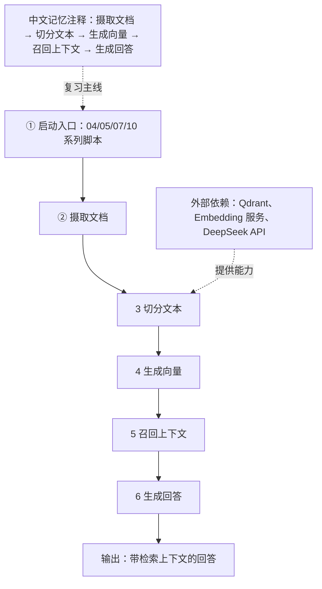
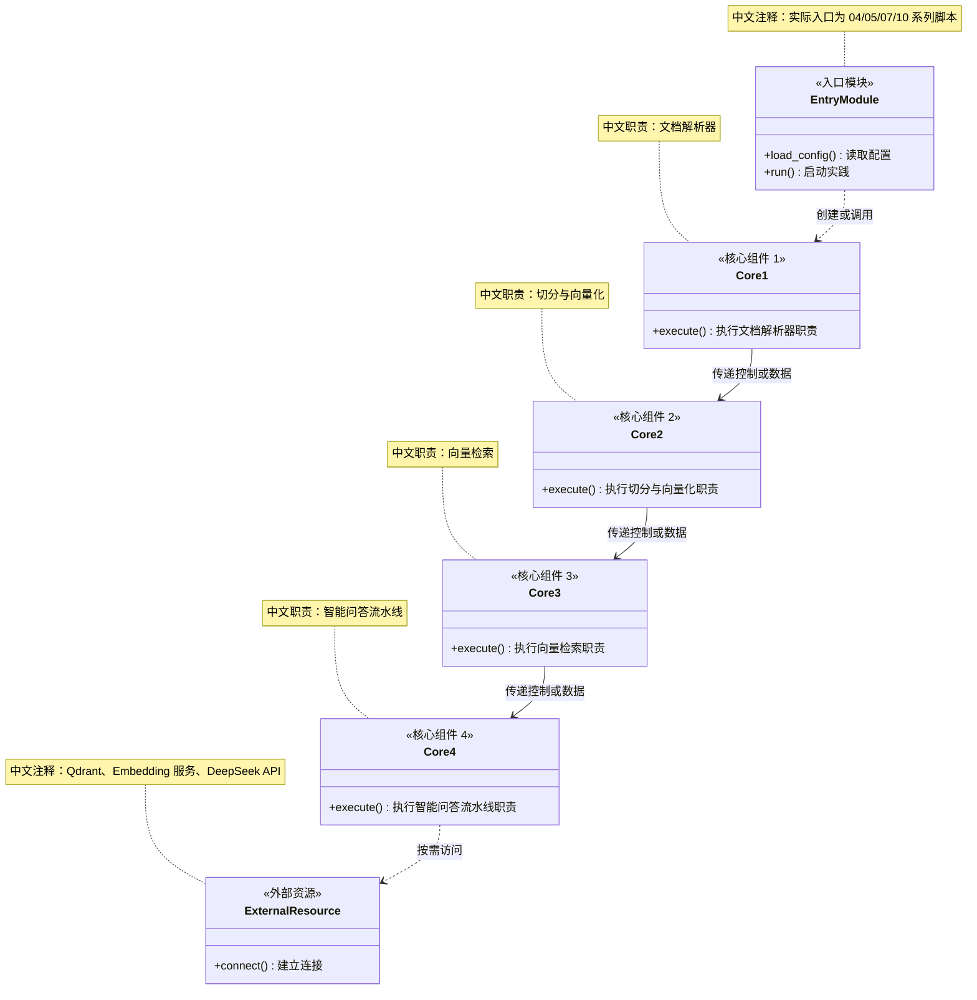
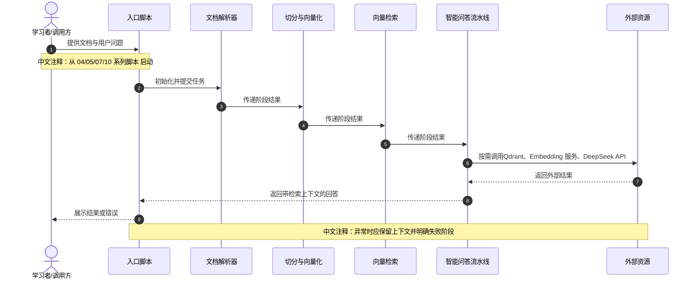
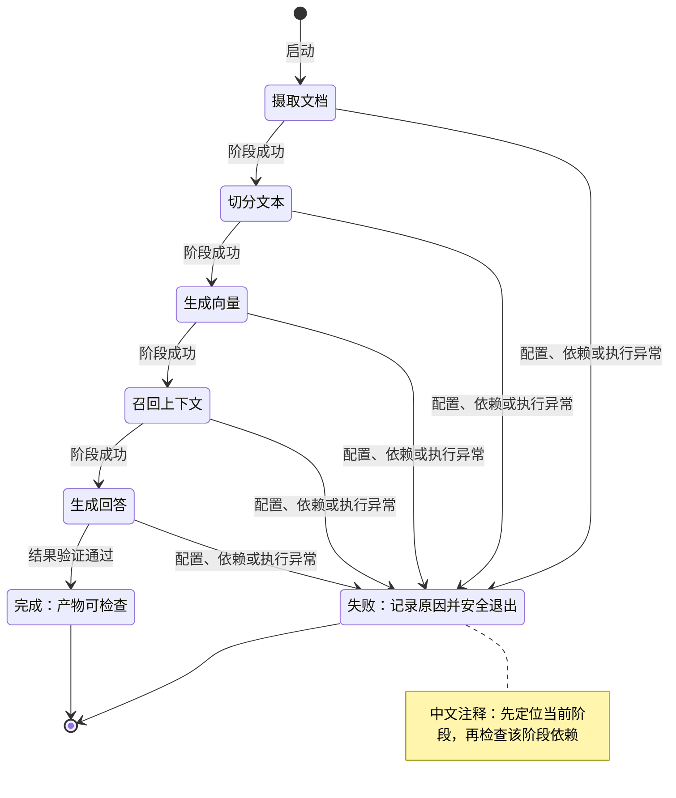
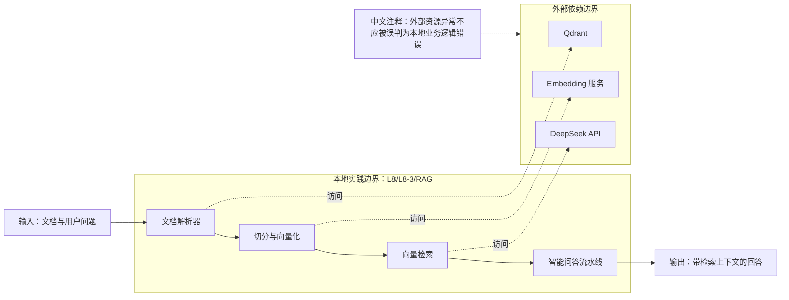
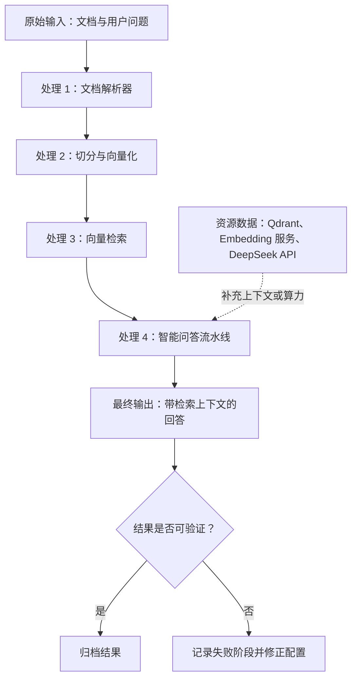
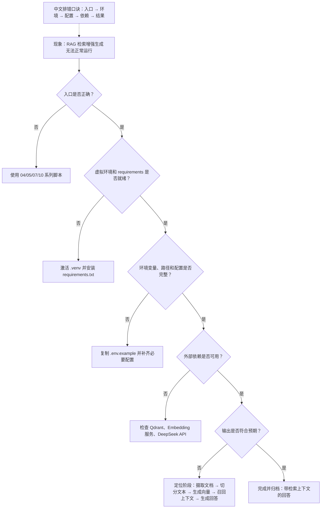

# RAG 检索增强生成：中文设计图谱

本图谱对应 `L8/L8-3/RAG`，入口为 `04/05/07/10 系列脚本`。所有图均保留独立 Mermaid
源文件，节点、关系、状态和 UML Note 使用中文注释。

建议学习顺序：总流程 → UML 关系 → 调用时序 → 生命周期 → 系统边界 → 数据流 → 排错。

## 1. 总执行流程图

独立归档：[Mermaid 源文件](./diagrams/01-execution-flow.mmd) · [SVG 成品图](./diagrams/01-execution-flow.svg)。

## 2. UML 组件/类关系图

独立归档：[Mermaid 源文件](./diagrams/02-uml-components.mmd) · [SVG 成品图](./diagrams/02-uml-components.svg)。

## 3. UML 时序图

独立归档：[Mermaid 源文件](./diagrams/03-sequence.mmd) · [SVG 成品图](./diagrams/03-sequence.svg)。

## 4. 生命周期状态图

独立归档：[Mermaid 源文件](./diagrams/04-lifecycle-state.mmd) · [SVG 成品图](./diagrams/04-lifecycle-state.svg)。

## 5. 系统边界图

独立归档：[Mermaid 源文件](./diagrams/05-system-boundary.mmd) · [SVG 成品图](./diagrams/05-system-boundary.svg)。

## 6. 数据流图

独立归档：[Mermaid 源文件](./diagrams/06-data-flow.mmd) · [SVG 成品图](./diagrams/06-data-flow.svg)。

## 7. 排错决策图

独立归档：[Mermaid 源文件](./diagrams/07-troubleshooting.mmd) · [SVG 成品图](./diagrams/07-troubleshooting.svg)。

## 8. 关键组件记忆表

| 编号 | 组件 | 记忆重点 |
|---|---|---|
| 1 | 文档解析器 | 对应流程中的核心职责节点 |
| 2 | 切分与向量化 | 对应流程中的核心职责节点 |
| 3 | 向量检索 | 对应流程中的核心职责节点 |
| 4 | 智能问答流水线 | 对应流程中的核心职责节点 |

输入：`文档与用户问题`  
输出：`带检索上下文的回答`  
外部依赖：`Qdrant、Embedding 服务、DeepSeek API`
